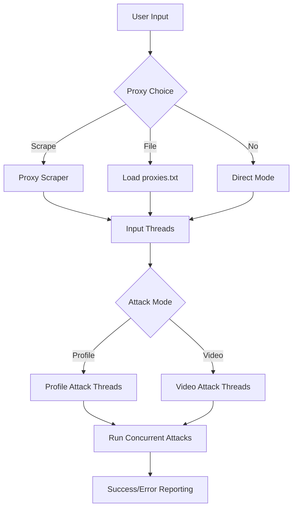

# 🎯 InstaReporterV2
  
<div align="center">  
  

```
╭━━╮╱╱╱╱╱╭╮╱╱╱╭━━━╮╱╱╱╱╱╱╱╱╱╱╭╮
╰┫┣╯╱╱╱╱╭╯╰╮╱╱┃╭━╮┃╱╱╱╱╱╱╱╱╱╭╯╰╮
╱┃┃╭━╮╭━┻╮╭╋━━┫╰━╯┣━━┳━━┳━━┳┻╮╭╋━━┳━╮
╱┃┃┃╭╮┫━━┫┃┃╭╮┃╭╮╭┫┃━┫╭╮┃╭╮┃╭┫┃┃┃━┫╭╯
╭┫┣┫┃┃┣━━┃╰┫╭╮┃┃┃╰┫┃━┫╰╯┃╰╯┃┃┃╰⫔┃━┫┃
╰━━┻╯╰┻━━┻━┻╯╰┻╯╰━┻━━┫╭━┻━━┻╯╰━┻━━┻╯
╱╱╱╱╱╱╱╱╱╱╱╱╱╱╱╱╱╱╱╱╱┃┃
╱╱╱╱╱╱╱╱╱╱╱╱╱╱╱╱╱╱╱╱╱╰╯  -V2
```
  
**🚀 Lightweight, Thread-Based Instagram Content Reporting Tool** *A streamlined and efficient automation tool built with a multi-threaded architecture.* [](https://python.org)  
[](LICENSE)  
[](https://github.com/muneebwanee/InstaReporterV2)  
  
</div>  
  
---  
  
## 🌟 What's New in V2
  
InstaReporterV2 is a complete rewrite focused on **simplicity, performance, and reduced dependencies**.
  
- **Lightweight Threading**: Replaced the heavy `multiprocessing` module with a more efficient `threading` model for concurrent operations.
- **Dependency Free**: Removed complex dependencies like `proxybroker` and `asyncio`. V2 only requires `requests` and `colorama`.
- **Built-in Proxy Scraper**: Integrated a lightweight proxy scraper that fetches fresh proxies from free proxy websites, removing the need for third-party libraries.
- **Refactored Codebase**: Simplified project structure (`modules/`) and improved code readability.
  
---  
  
## 📋 Features  
  
### 🎯 **Dual Attack Modes** - **Profile Reporting**: Target specific Instagram user profiles.
- **Video Content Reporting**: Report individual video posts.
  
### ⚡ **High-Performance Architecture** - **Multi-Threading Engine**: Utilizes a user-defined number of threads for concurrent reporting tasks.
- **Optimized Proxy Handling**: Efficiently loads and rotates proxies (from file or scraper) for each thread.
  
### 🛡️ **Advanced Anonymity System** - **Built-in Proxy Scraper**: Automatically scrapes proxies from multiple online sources.
- **Custom Proxy Lists**: Full support for user-provided proxy files.
- **User Agent Rotation**: 90+ realistic browser user agents to mimic real devices.
- **Protocol Intelligence**: Automatic HTTP/HTTPS proxy configuration.
  
### 🎨 **Professional User Interface** - **Colorized Console Output**: Clean terminal interface with status indicators (Success, Fail, Retry).
- **Real-time Progress Tracking**: Live monitoring of reporting attempts.
- **Error Handling**: Clear error reporting for failed requests or bad proxies.  
  
---  
  
## 🚀 Quick Start  
  
### Prerequisites  
  

#### Python 3.7 or higher required
python --version
 
### Installation
 
  * Clone the repository

```
   git clone https://github.com/muneebwanee/InstaReporterV2.git
   cd InstaReporterV2
```
<!-- end list -->
  
* Install dependencies
   
```  
# Install from requirements.txt
pip install -r requirements.txt
```

* Or manually

```
pip install requests colorama  
```

 * Run the application
```
python InstaReporterV2.py
```
---  
  
## 📋 Usage Guide  
  
### 🎯 **Interactive Mode** The application provides an intuitive step-by-step interface:  
  
1. **Proxy Configuration** - Choose to use proxies or run without them.
   - `1`: Auto-scrape proxies from the internet.
   - `2`: Provide your own proxy list file (`proxies.txt`).
  
2. **Thread Count**
   - Enter the number of concurrent threads you want to run.
  
3. **Attack Mode Selection** - `1` - Report Instagram profiles.
   - `2` - Report Instagram videos.
  
4. **Target Specification** - Enter the username (for profiles).
   - Enter the video URL (for videos).
  
### 📁 **Proxy File Format** If you use your own list, create a `proxies.txt` file in the same directory with one proxy per line:  

proxy1.example.com:8080
proxy2.example.com:3128
192.168.1.100:8080
  
---  
  
## 🏗️ Architecture Overview  
  
### 🔧 **Core Components** - **Main Orchestrator** (`InstaReporterV2.py`): Thread management and user interaction.
- **Attack Engine** (`modules/attack.py`): HTTP request handling and form submission.
- **Proxy Utilities** (`modules/proxy_utils.py`): Proxy scraping, loading, and formatting.
- **Utility Suite** (`modules/utils.py`): Console interface (colors, banners) and file operations.
  
### 🔄 **Workflow Architecture** 


🎯 Attack Process Flow 1. Session Initialization: Create HTTP session with proxy configuration.
 * Authentication Chain: Facebook → Instagram cookie extraction.
 * Form Parameter Extraction: Dynamic token and session data parsing.
 * Report Submission: POST request to Instagram's help infrastructure.
 * Response Validation: Success/error status verification.
⚙️ Configuration
🔧 Performance Tuning - Thread Count: This is the main performance lever and is set by the user at runtime. More threads increase request volume but also require more system resources.
 * HTTP Timeout: A 10-second timeout is hardcoded for all network requests to prevent threads from hanging on bad proxies.
🛡️ Security Features - Dynamic User Agents: Automatic browser user agent rotation on every request.
 * Cookie Management: Automatic session handling and cookie extraction.
 * Error Resilience: Comprehensive exception handling for network errors, timeouts, and bad proxies.
📊 System Requirements
🖥️ Minimum Requirements - OS: Windows 7+, macOS 10.12+, Linux (any modern distro)
 * Python: 3.7 or higher
 * RAM: 256MB available memory
 * Network: Stable internet connection
📦 Dependencies - requests[socks] - HTTP client with SOCKS proxy support
 * colorama - Cross-platform colored terminal text
🛠️ Development
📁 Project Structure
```
InstaReporterV2/
├── InstaReporterV2.py    # Main application entry point
├── requirements.txt      # Project dependencies
├── modules/
│   ├── attack.py         # Core attack functionality
│   ├── proxy_utils.py    # Proxy scraping and management
│   ├── user_agents.py    # Browser user agent rotation
│   ├── utils.py          # Utility functions (UI, colors)
│   ├── logo.py           # ASCII art and UI elements
│   └── check_modules.py  # Dependency validation
└── README.md             # This file
  ```

### 🔍 **Key Functions** - `profile_attack_threaded()` / `video_attack_threaded()`: Worker functions for threads.
- `report_profile_attack()` / `report_video_attack()`: Core attack logic.
- `load_proxies()`: Loads proxies from `proxies.txt`.
- `get_proxy_from_url()`: Scrapes and returns a list of proxies from online sources.
  
---  
  
## ⚠️ Legal Disclaimer  
  
This tool is designed for **educational and research purposes only**. Users are responsible for:  
  
- ✅ Complying with Instagram's Terms of Service  
- ✅ Following local and international laws  
- ✅ Using the tool ethically and responsibly  
- ❌ Not engaging in harassment or malicious activities  
  
**The developers assume no responsibility for misuse of this software.** ---  
  
## 🤝 Contributing  
  
We welcome contributions! Here's how you can help:  
  
1. **🍴 Fork the repository** 2. **🌿 Create a feature branch** (`git checkout -b feature/amazing-feature`)  
3. **💾 Commit your changes** (`git commit -m 'Add amazing feature'`)  
4. **📤 Push to the branch** (`git push origin feature/amazing-feature`)  
5. **🔄 Open a Pull Request** ### 🐛 **Bug Reports** Found a bug? Please open an issue with:  
- Detailed description  
- Steps to reproduce  
- Expected vs actual behavior  
- System information  
  
---  
  
## 📞 Support & Contact  
  
<div align="center">  
  
**👨‍💻 Producer: Muneeb** [](https://instagram.com/muneebwanee)  
[](https://github.com/muneebwanee)  
[](mailto:muneebwanee@gmail.com)  
  
</div>  
  
---  
  
## 📄 License  
  
This project is licensed under the **MIT License** - see the `LICENSE` file for details.  
  
---  
  
<div align="center">  
  
**⭐ If this project helped you, please give it a star! ⭐** *Made with ❤️ by [Muneeb](https://github.com/muneebwanee)* </div>
